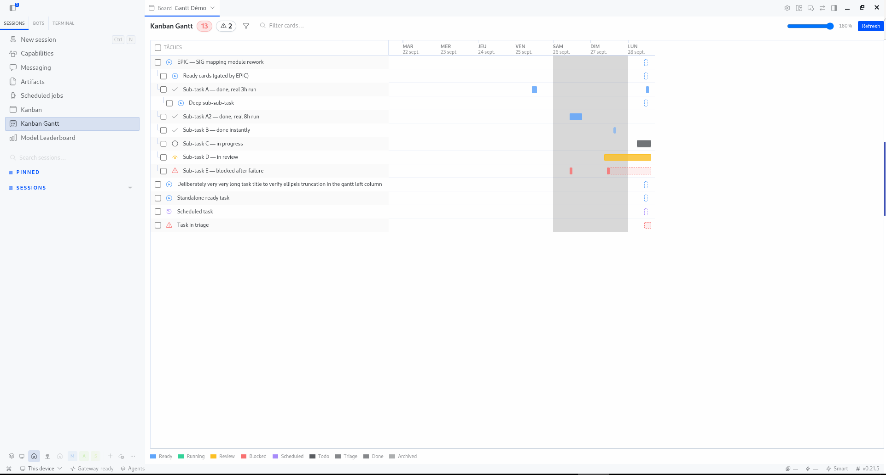
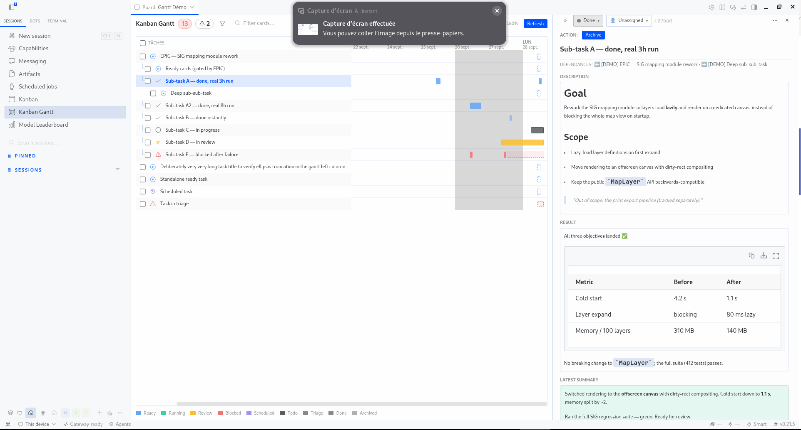

# Hermes Kanban Gantt

[](LICENSE)
[](#tests)
[](#architecture)

A **Gantt timeline view** plugin for [Hermes Desktop](https://hermes-agent.nousresearch.com) — a full-page `/kanban-gantt` route that renders any Hermes kanban board as a timeline of real work (created / started / done timestamps), not a forecast planner.

```
Kanban Gantt ── 20 ────────────────────────────────  [◄ zoom ►] [Refresh]
TÂCHES        │ LUN 7 ── MAR 8 ── MER 9 ── JEU 10 ── VEN 11 ── …
☑ Epic X      │        ▓▓▓▓▓▓▓░░░░░░░▓▓▓▓ (running)
☐ Sub-task A  │              ▓▓▓▓▓ (done)
```

## Features

- **Full desktop page** (`/kanban-gantt`) + sidebar entry + ⌘K palette command.
- **Board switcher** projected into the desktop page-header band (`WORKSPACE_PAGE_HEADER_AREA`), styled like the official kanban switcher, with an "All boards" aggregate mode; per-board badges on rows in aggregate view. Requires Hermes ≥ 0.21.5.
- **Real timeline bars** — from the kanban tasks' actual timestamps (created / started / review / done), with live-activity arc on running tasks, weekend shading, zoom (7 days at 100%), auto-scroll to "now".
- **Dependencies** — parent → child links drawn as tree connectors in the task column and dependency chains in the timeline.
- **Task detail drawer** — status transitions (action matrix), assignee, comments, runs, attachments; dockable (`«` / `»`) beside the gantt instead of overlaying, resizable, position persisted.
- **Bulk operations** — multi-select rows (header checkbox, shift-click) → move status, assign, archive, delete.
- **Filters** — by assignee, by status, show/hide archived, text search.
- **Readable by design** — sticky opaque label column, opaque dropdown menus, resizable label column, all state persisted per plugin.

## Install

```bash
hermes plugins install e-is/hermes-kanban-gantt
```

Verify: `Mounted plugin API routes: /api/plugins/kanban-gantt/` in `~/.hermes/logs/agent.log`, then ⌘K → « Kanban Gantt ».

## Layout

```
plugin.yaml          unified plugin manifest
__init__.py          no-op register() (capability probe only)
dashboard/           backend — FastAPI router → /api/plugins/kanban-gantt/
  manifest.json      name/label/version/api pointer
  plugin_api.py      gantt snapshot, boards, task detail, status/comment routes
src/                 AUTHORING SOURCES (TypeScript)
  main.ts            renderer entry — bundled to desktop/plugin.js by esbuild
  core/gantt-core.ts pure timeline logic (no React/SDK)
  sdk.d.ts           ambient types for the SDK subset in use
desktop/             BUILD ARTIFACTS — loaded uncompiled by Hermes Desktop
  plugin.js          bundled renderer (do not edit; run `npm run build`)
  gantt-core.js      bundled pure core (tests + demo import it)
install.sh           optional convenience installer (desktop half + backend half)
tests/               node:test suite (pure gantt core, sticky label), pytest backend
                     suite, demo server (one port: demo + API + plugin.js)
```

Build & test:

```bash
npm install            # esbuild
npm run build          # src/ → desktop/
npm run check          # syntax-gate the artifacts
node --test tests/gantt-core.test.mjs tests/test_sticky.mjs
bash tests/run_tests.sh
```

## Architecture

- **Backend owns** all data access: reads the shared kanban SQLite store
  (`~/.hermes/kanban/boards/<slug>/kanban.db`), serves the Gantt snapshot
  (rows, bars, domain, dependencies), and routes status transitions /
  comments / bulk writes through the same domain layer as the core kanban.
  Mounted at `/api/plugins/kanban-gantt/` by the desktop's `hermes serve`.
- **Renderer owns** everything visual: timeline math (pure `GANTT_CORE_SRC`
  core, testable in isolation), rows, bars, filters, drawer, and the
  desktop-page chrome (sidebar entry, palette command, page-header switcher).
- **Zero API keys, zero model tokens** — no network I/O beyond the local
  Hermes gateway and the local SQLite store.

## Tests

```bash
# pure core + sticky label (node:test, no deps)
node --test tests/gantt-core.test.mjs tests/test_sticky.mjs

# backend (isolated venv; HERMES_AGENT_HOME points at a hermes-agent checkout)
tests/run_tests.sh
```

## Demo

Runs the plugin's real backend + a standalone demo page in a browser — no
Hermes desktop needed. Prereqs: `node`, `playwright` (npm, for the scripted
run only), a Python with `fastapi` + `uvicorn` for the backend.

```bash
# 1. one-time: machine-local paths (see .env.example)
cp .env.example .env   # then edit KG_PYTHON / KG_* paths

# 2. interactive demo page (auto-spawns the standalone backend)
node tests/demo-server.mjs          # → open http://127.0.0.1:4200/demo.html

# 3. or headless scripted run + screenshots in tests/demo-shots/
node tests/demo_playwright.mjs
```

Machine-specific paths (python, playwright, browsers, hermes checkout) come
from `.env` (gitignored, `KG_*` variables — environment variables always win).

## Screenshots





## License

GPL-3.0 — see [LICENSE](LICENSE).
